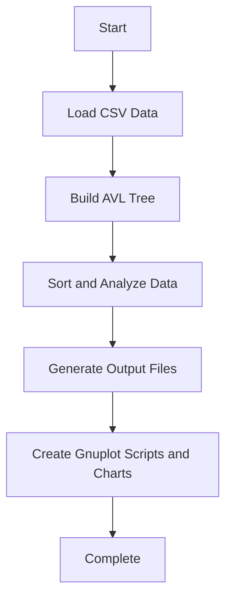

# Projet CY-Wire  

## Table of Contents  
- [Projet CY-Wire](#projet-cy-wire)
  - [Table of Contents](#table-of-contents)
  - [Introduction](#introduction)
    - [Key Features:](#key-features)
  - [Functionalities](#functionalities)
    - [Core Functionalities](#core-functionalities)
  - [Project Structure](#project-structure)
  - [Team](#team)
  - [How to Build](#how-to-build)
  - [How to Use](#how-to-use)
    - [1. Place Input Data](#1-place-input-data)
    - [2. Execute the Script](#2-execute-the-script)
      - [Parameters](#parameters)
      - [Examples](#examples)
    - [3. View Output Files](#3-view-output-files)
  - [Technical Details](#technical-details)
    - [Workflow Diagram](#workflow-diagram)
  - [Future Improvements](#future-improvements)
  - [More](#more)

---

## Introduction  

**CY-Wire** is a robust application leveraging AVL trees to efficiently process, sort, and visualize data related to electric stations. This project was designed to streamline data analysis while providing meaningful visual insights via Gnuplot.  

### Key Features:  
- **Data Collection:** Imports and processes electric station data from CSV files.  
- **Sorting and Analysis:** Organizes stations by metrics such as capacity or difference values.  
- **Ranking:** Generates top 10 and bottom 10 station rankings.  
- **Visualization:** Produces automated scripts and charts for clear data representation.  

---

## Functionalities  

### Core Functionalities  
- **Sorting:** Implements AVL trees for efficient sorting of station data.  
- **File Generation:** Exports sorted data to CSV files for easy access.  
- **Visualization:** Utilizes Gnuplot scripts to generate insightful charts.  
- **Data Analysis:** Highlights key metrics to identify top-performing and underperforming stations.  

---

## Project Structure  

```
CY_Wire
├── codeC
│   ├── bin
│   │   └── main
│   ├── obj
│   │   ├── main.o
│   │   └── tree.o
│   ├── main.c
│   ├── makefile
│   ├── tree.c
│   └── tree.h
├── input
│   └── <input files: see "How to Use">
├── output
│   └── <generated results>
├── tmp
│   └── <temporary files - can be ignored>
├── .gitignore
├── c-wire.sh
├── LICENSE
└── README.md
```  

---

## Team  

- **Paul PFLEGER**  
  [GitHub](https://www.github.com/p3t1tpa1n/)  
- **Mathias DA COSTA SILVA**  
  [GitHub](https://www.github.com/mxth2xs/)  
  [LinkedIn](https://www.linkedin.com/in/mathias-dcs/)  
- **Benjamin BABIKIAN**  
  [GitHub](https://www.github.com/Benji1234soleilalorsquequatre/)  

*Note:* This project also integrates AI-generated components to enhance functionality.  

---

## How to Build  

1. Clone the repository:  
   ```bash
   git clone https://github.com/mxth2xs/CY_Wire.git
   ```  
2. Navigate to the project directory:  
   ```bash
   cd CY_Wire  
   ```  
3. Prepare your data by following the "[How to Use](#how-to-use)" section.  
4. Execute the script with the desired parameters or use:  
   ```bash
   ./c-wire.sh -h  
   ```  

---

## How to Use  

### 1. Place Input Data  
Ensure your input data file is located in the `input/` directory.  

### 2. Execute the Script  
Use the syntax:  
```bash
./c-wire.sh <csv_file_path> <station_type> <consumer_type> [plant_id]  
```  

#### Parameters  
- **`csv_file_path`:** Path to the CSV file containing station data.  
- **`station_type`:** Type of station to analyze (`hvb`, `hva`, `lv`).  
- **`consumer_type`:** Consumer category (`comp`, `indiv`, `all`).  
- **`plant_id`:** *(Optional)* Filter by specific plant ID; defaults to `-1` (no filter).  

#### Examples  
- Analyze all low-voltage stations for all consumer types:  
  ```bash  
  ./c-wire.sh data.csv lv all  
  ```  
- Analyze high-voltage B stations for companies with Plant ID `1234`:  
  ```bash  
  ./c-wire.sh data.csv hvb comp 1234  
  ```  

### 3. View Output Files  
Results will be generated in the `output/` directory.  

---

## Technical Details  

### Workflow Diagram  



---

## Future Improvements  

- Introduce additional metrics for analysis and sorting.  
- Enable interactive visualizations for dynamic insights.  
- Develop a web-based frontend for simplified user interaction.  

---

## More  

For questions or contributions, reach out to any team member via the [Team](#team) section.  

*Special thanks to our CYTech instructors for their guidance and support!*  